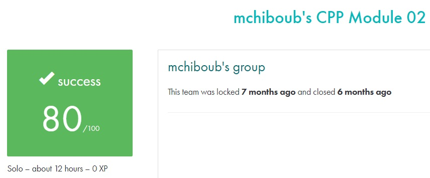

# C++ module 02 #

## What the project does: ##
The C++ - Module 02 project focuses on ad-hoc polymorphism, operator overloading, and the Orthodox Canonical Class Form. Through exercises, it introduces creating classes in canonical form, overloading operators, and building a fixed-point number class for representing numerical values with a fractional part.

## Why the project is useful: ##
This project is useful because it teaches advanced object-oriented programming techniques in C++, such as polymorphism and operator overloading. These skills are crucial for writing more flexible and reusable code. It also solidifies your understanding of memory management and class structure in C++.

[Subject of this project](en.subject.pdf)